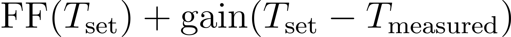
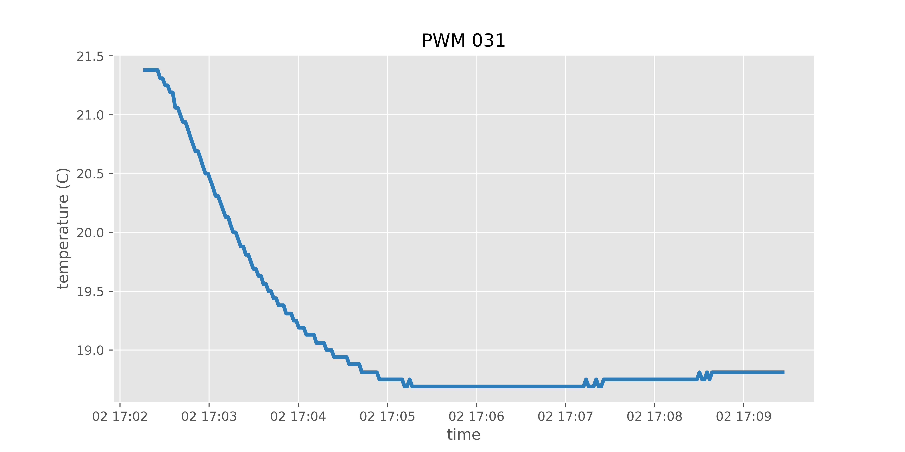
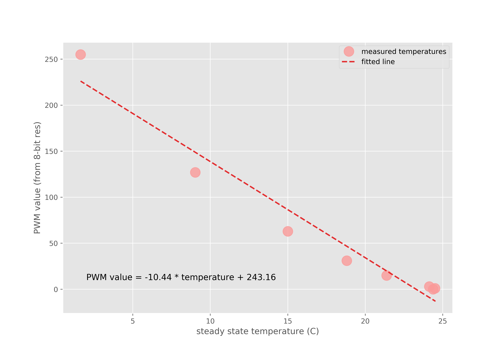
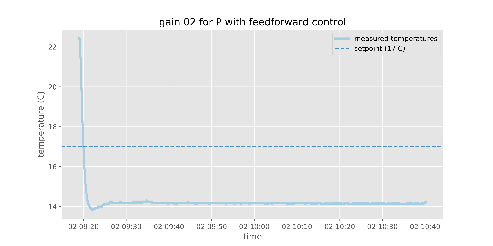
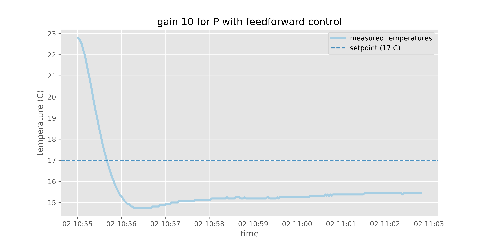
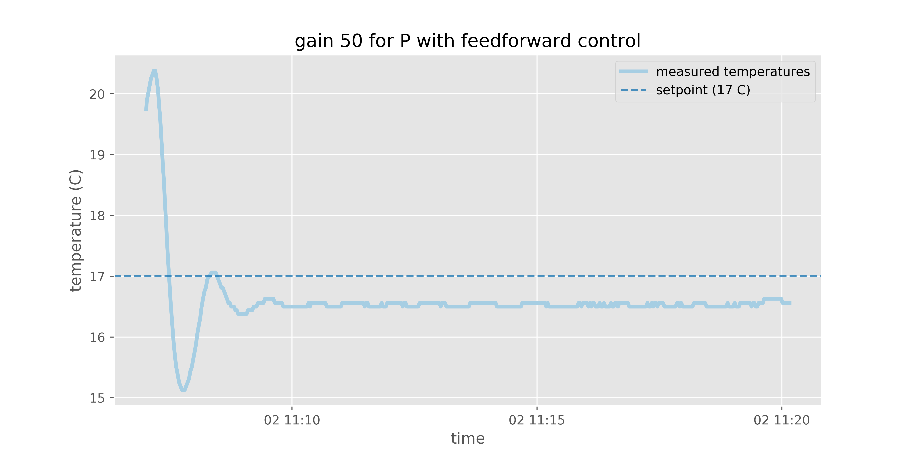

# How to make an insect cooling stage

**_N.B._ This project is a work-in-progress!**

I outline the steps for making a DIY insect cooling stage. Cold temperatures immobilize insects so they can be used for common downstream preparations in neurobiology experiments. Cooling stages provide a useful alternative to carbon dioxide-based methods, which result in physiological and behavioural side-effects on the insect. In addition, a cheap and easy to assemble cooling stage may prove useful for those who wish to do some preliminary experimentation from home, during the ongoing COVID-19 crisis. 

Peter Weir's [excellent blog post](https://ptweir.github.io/flyBridge/) inspired this project, but I decided I didn't want to spend money on a fancy temperature controller like [TE Tech's TC-48-20](https://tetech.com/product/tc-48-20/). Below, I detail my amateur efforts on making a closed-loop temperature controller for an insect cooling stage. I thank [Will Dickson](https://github.com/willdickson) for hardware recommendations and for general troubleshooting and control systems advice—in particular for suggesting a proportional control scheme with a feedforward term. 

## General mechanism

The basic workings behind this cooling stage is straightforward. Similar to a DC motor, whose speed is a direct function of the DC voltage going across it, a [Peltier device](https://en.wikipedia.org/wiki/Thermoelectric_cooling)'s output temperature is a function of the DC voltage across its leads. By extension, we can flip the voltage polarity across the leads of the Peltier device to reverse its hot and cold sides, just like how we can flip the polarity across a DC motor, to spin it in reverse. In other words, if we can control the DC voltage going across the Peltier, we can control how cold our cooling stage will be. 

To tune the voltage across the Peltier, we are going to use a microcontroller to apply a [pulse-width modulation (PWM)](https://en.wikipedia.org/wiki/Pulse-width_modulation) train across the Peltier's leads. In short, a PWM pulse train is akin to power cycling a load at an extremely high frequency. In doing so, we can reach voltage levels that are between full blast (12 V, in this case) and zero. The Peltier device does not 'perceive' the rapid on and off switching, and instead sees the average voltage. More specifically, we adjust the pulse width of the PWM train—from rising to rising, usually—to achieve different average voltage levels. We refer to the pulse width adjustment as the PWM's "duty cycle". So if a 100% duty cycle outputs 12 V, then a 50% duty cycle outputs an average of 6 V. Importantly, the frequency of the PWM remains constant, when we adjust the duty cycle. The minimum PWM frequency to achieve a perceptibly stable average voltage depends on the intricacies of the load we are trying to control. Peltier devices demand a rather high minimum PWM frequency. The internet recommends at least [500 Hz](https://forum.pololu.com/t/vnh2sp30-peltier-nonlinear-current-at-high-pwm-frequency/1646/6) for some Peltiers, and [at least 2000 Hz](https://www.physics.utoronto.ca/~phy326/xrf/APPENDIX%20E.pdf) for other models.

My cooling stage also uses a temperature sensor to determine whether the desired temperature has been reached. I detail later on in the text, the particular control scheme I use to achieve feedback, but in short, I try both a bang-bang control scheme and a proportional (P) control scheme with a feedforward term. I opt for the latter, because switching between 0% and 100% duty cycles (actual power-cycling) [wreaks havoc](https://www.reddit.com/r/AskEngineers/comments/8dwfn9/controlling_tecpeltier_plate_modules/) on the lifespans of Peltiers. 

## Materials

In addition to the usual hobby electronics tools and consumables—jumper wires, breadboard, multimeter, etc.—I use the following parts:

- [Teensy 3.2 microcontroller](https://www.pjrc.com/store/teensy32.html) 
- [VNH5019 DC motor driver](https://www.pololu.com/product/1451)   
- [Waterproof DS18B20 temperature sensor](https://www.amazon.com/gp/product/B01LY53CED/ref=ppx_yo_dt_b_asin_title_o08_s00?ie=UTF8&psc=1) and a 4.7 kOhm resistor
- [Air-cooled Peltier module](https://www.adafruit.com/product/1335) [(recommended in Peter's blog)](https://ptweir.github.io/flyBridge/)
- [12 V power supply rated for at least 6 A](https://www.amazon.com/gp/product/B07M981HSV/ref=ppx_yo_dt_b_asin_title_o01_s00?ie=UTF8&psc=1)

## Circuit

Connect the DC motor driver to the Teensy as specified in the below schematic [from Pololu](https://www.pololu.com/product/1451). Note that the GNDs for the motor and logic powers are common:


Then connect the DS18B20 temperature sensor. Place the 4.7 kOhm [pull-up resistor](https://learn.sparkfun.com/tutorials/pull-up-resistors/all) in parallel with the sensor's signal and VCC lines. Connect the sensor's signal wire to any digital pin on the Teensy, its GND to the common GND, and its VCC to the common logic VCC. See [this blog post](https://create.arduino.cc/projecthub/TheGadgetBoy/ds18b20-digital-temperature-sensor-and-arduino-9cc806) for more details. 

Our circuit wiring might look something like this:


Don't fret if your wiring doesn't look exactly like the photo above. So long as the digital wires go to the digital pins, GND goes to GND, VCC goes to VCC, and PWM goes to PWM, you should be set. Don't forget to plug in the Peltier module's fan! The fan is also 12 V, so it can plug into the same 12 V power supply that's powering the Peltier device. 

## Firmware

If you want to get your cooling stage going right away, upload [this sketch](https://github.com/hanhanhan-kim/cold_stage/blob/master/firmware/pwm_dc_ds18b20_FF_P_loop/pwm_dc_ds18b20_FF_P_loop.ino) to your Teensy and call it a day! Just edit the line specifying the setpoint temperature (C), `const float setpointC = 17;`, to whatever you fancy—probably something like `4` C. If you're interested in a little bit of the troubleshooting and validation process I went through to arrive at the recommended firmware, continue to the next section. Otherwise, enjoy your icy immobile insects!


## Troubleshooting and validation

I originally started off with one of the new Arduino Nanos, the [Arduino Nano Every](https://store.arduino.cc/usa/nano-every), as my microcontroller. I ran into some trouble, however, because pushing its PWM frequency past its ~500 Hz defaults is [currently a bit of a headache](https://forum.arduino.cc/index.php?topic=626736.0). The Teensy 3.2, however, can reach some [very high frequencies](https://www.pjrc.com/teensy/td_pulse.html), with just a [few lines of simple code](http://mb-raw.blogspot.com/2018/02/teensy-and-pwm.html). In short, a win for the Teensy. 

### Bang-bang control

My firmware originally implemented a [bang-bang control](https://en.wikipedia.org/wiki/Bang%E2%80%93bang_control) scheme. The bang-bang control firmware I wrote can be found [here](https://github.com/hanhanhan-kim/cold_stage/blob/master/firmware/pwm_dc_ds18b20_bangbang_loop/pwm_dc_ds18b20_bangbang_loop.ino). In this system, the Peltier is in one of two discrete states: full blast (100% duty cycle) or nothing at all (0% duty cycle). When under bang-bang control, the Peltier starts off in full blast mode so that it can reach its setpoint, the desired temperature, as fast as it can. Upon reaching the setpoint, the Peltier fails to cease cooling in time, and so the Peltier undershoots the desired temperature. This undershooting triggers the Peltier to enter its total off state, so that the temperature can rise back up towards the setpoint, as quickly (and as passively) as possible. Under this regime, the Peltier overshoots its setpoint, which causes the device to enter its 100% duty cycle state again. This infinite oscillation between the two discrete 100% and 0% duty cycle states actually hovers around the setpoint, reasonably tightly, and with acceptable latency. See this figure I generated from a single trial of temperature measurements while my Peltier was under bang-bang control:


The main disadvantage of the bang-bang control for our application, however, is its [impact on the Peltier's lifespan]((https://www.reddit.com/r/AskEngineers/comments/8dwfn9/controlling_tecpeltier_plate_modules/)), which I mentioned in the beginning. The constant powering on and off, as the Peltier switches between 100% to 0% duty cycles, is far [less than ideal](https://thermal.ferrotec.com/technology/thermoelectric-reference-guide/thermalref10/). I needed a different control scheme. 

### Proportional (P) control with a feedforward term

The [PID control system](https://en.wikipedia.org/wiki/PID_controller) is one of the most famous and popular control schemes ever devised (and there are [many](https://www.arrow.com/en/research-and-events/articles/pid-controller-basics-and-tutorial-pid-implementation-in-arduino) [tutorials](https://www.teachmemicro.com/arduino-pid-control-tutorial/) for implementing it on a microcontroller), but it is often finicky to tune and can sometimes be overkill, depending on the application. For example, in systems with slow dynamics, like in most temperature systems, the integral term of a PI or PID control system can easily promote instability. For this reason, [Will](https://github.com/willdickson) advised that I limit myself to a P control system instead, but to include a feedforward (FF) term, so that upon initialization, I can ballpark the correct PWM value needed to reach the setpoint temperature. The P control term would then push the ballpark estimate to a steady state that approximates the setpoint. Expressed more precisely, 

<p align="center">
  
</p>

To implement the above control scheme, we first need to approximate the FF function. To do so, we try and build a relationship between PWM values and their resulting steady-state Peltier temperatures. We do so by uploading an open loop scheme to our microprocessor. The one I wrote and used is [here](https://github.com/hanhanhan-kim/cold_stage/tree/master/firmware/pwm_dc_ds18b20_open_loop). I collect with it the following timeseries data (while I don't show them below, because they depict just room temperature, I also collected temperature data for PWM 0 and PWM 1; they can be found [here](https://github.com/hanhanhan-kim/cold_stage/tree/master/plots/temps_vs_time_for_PWM)):





The FF function does not need to very good, because the P term of our control scheme will correct for deviations from the setpoint. For this reason, we can just eyeball the measured steady-state temperature for each PWM setting, and plot those temperatures against their PWM values. We then perform a quick and dirty linear regression to derive the approximate FF function:



We implement this FF function in our final [firmware](https://github.com/hanhanhan-kim/cold_stage/blob/master/firmware/pwm_dc_ds18b20_FF_P_loop/pwm_dc_ds18b20_FF_P_loop.ino) ...

```cpp
float feedforward(float setpointC){
  float pwmValue;
  pwmValue = -10.44 * setpointC + 243.16;
  return pwmValue;
}
```

... and use it with the P control ...

```cpp
if (pwmValue <= 255 && pwmValue >=0){
    float ff = feedforward(setpointC);
    float error = setpointC - sensors.getTempCByIndex(0);
    
    float pwmValue = ff - gainP * error;
    // Set PWM pin to our new PWM value:
    analogWrite(pwmPin, pwmValue);
  }
```

Before we can call it a day, we need to tune the magnitude of our gain term. P control is [readily susceptible to](https://softwareengineering.stackexchange.com/questions/214912/why-does-a-proportional-controller-have-a-steady-state-error) [steady-state error](https://en.wikipedia.org/wiki/Proportional_control#Offset_error). One way to reduce this error is by adding an integral (I) term, so we can consider the cummulative error history. But as mentioned above, doing so is finicky for our application. An alternative simpler solution is to simply crank up the gain's magnitude. Doing so will push our steady-state temperature closer to the setpoint, but if we set the magnitude of our gain too high, our system will become unstable. Below, I plot the measured temperatures for three different gain values in our system:





The above data suggests that a gain of magnitude 50 is close to appropriate. The steady state temperature is only half a degree or so off from the setpoint. We employ a gain of magnitude 50 in our final temperature control system. 
 
 \
 \
 \
TODO: Add button (support only a single setpoint, probs 4C) or pot (support many setpoints)\
TODO: Add 7-segment display\
TODO: Try liquid-cooled Peltier\
TODO: If using liquid-cooled Peltier, think of a cheap way to flow the liquid. Probably pond or aquarium pump.\
TODO: Design and mill aluminum plate that has a socket for securing the temperature sensor; screw onto Peltier and use CPU cooling paste\
TODO: Design casing\
TODO: Design PCB?


<!-- One of the many reasons the Teensy is great is because it has tons of digital and PWM pins—way more than the Arduino Nano, which despite having a similar form factor, provides less generous pin options.  -->

<!-- I have a delay(1000) term, which is fine, given how slow my system is. But if I want to change the timestep, I can preserve the dynamics by scaling the timestep with the gain. the relationship is:
gain1 / dt1 = gain2 / dt2 -->


 


